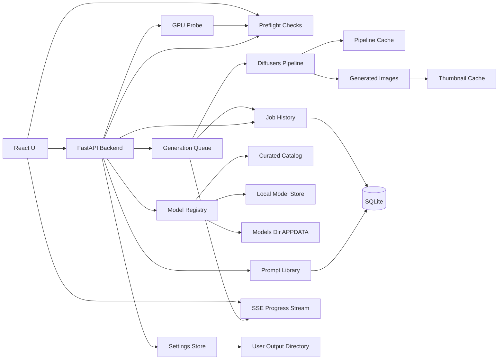
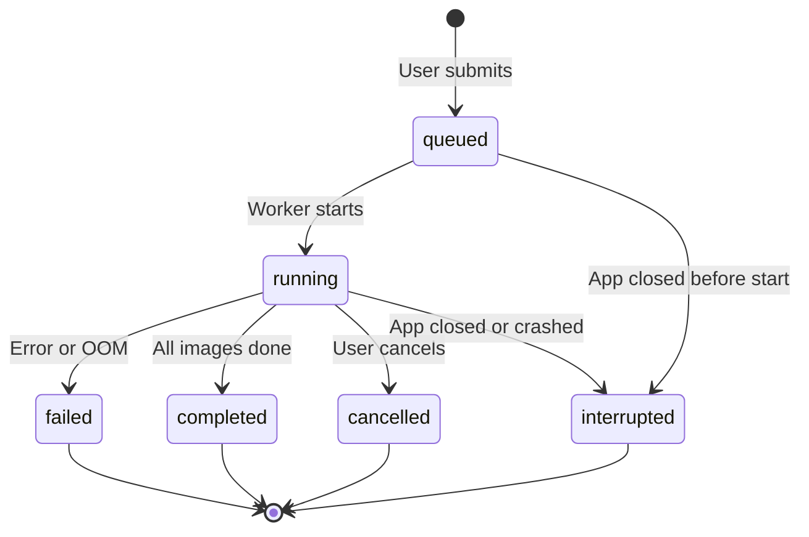
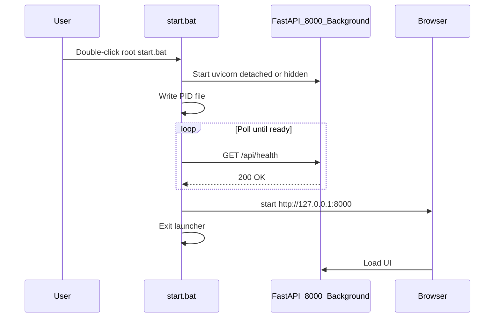

# Local Image Generator — Build Plan

> Saved for future implementation. Last updated: 2026-06-29.

## Summary

Plan a **Windows-only** localhost image generator that runs startup preflight checks, detects NVIDIA GPU VRAM, filters compatible text-to-image models, lets users choose or import models, edit prompt templates, save prompts to a personal library, and generate multiple images sequentially on 8GB-class GPUs—with full job history across app restarts.

## Design Decisions

| Area | Decision |
|------|----------|
| App shell | Local web app: Python backend + browser UI at `http://127.0.0.1:8000` |
| App URL / port | **`http://127.0.0.1:8000`** — fixed port **8000** in v1 |
| Browser launch | Auto-open default browser via root `start.bat` after backend health check passes |
| App launcher | **`start.bat`** at **project root**; starts backend in **background**; launcher exits after browser opens |
| Platform | **Windows only** (Windows 10/11); no Linux or macOS support in v1 |
| GPU target | NVIDIA CUDA on Windows |
| Model management | Curated in-app catalog with downloads **and** local model import |
| Generation scope (v1) | Text-to-image only |
| Multi-image behavior | Queue sequentially with progress; safest for 8GB VRAM |
| Initial model catalog | **2–3 SD 1.5** models + **1 SDXL** in curated catalog (expand after 8GB tuning) |
| Model storage | Single directory: `%APPDATA%/OnPremImageGenerator/models`; lazy download on model select |
| Pipeline loading | Lazy load on first generate; cache in memory until model changes |
| Progress updates | Server-Sent Events (SSE) for live job progress and image-complete events |
| Gallery thumbnails | 256px cached thumbs; full PNG only on preview/download |
| Default generation | DPM++ 2M scheduler, **25 steps** default |
| Generation runtime | Diffusers runs in a **separate worker process**; FastAPI stays responsive |
| Attention backend | **SDPA** (PyTorch 2.x) preferred; xFormers fallback; attention slicing last resort |
| Prompt encoding | Encode prompt + negative prompt **once per job**, reuse for all images |
| Model warmup | Run 1-step dummy generation after pipeline load |
| GPU speedups | TF32 + `cudnn.benchmark` on Ampere/Ada GPUs; `torch.inference_mode()` |
| Progress granularity | SSE emits **per-step** progress, not only per-image |
| File writes | PNG save + thumbnail generation run on a **background thread pool** |
| SQLite mode | WAL + `synchronous=NORMAL` for non-blocking reads |
| Static assets | Long `Cache-Control` + gzip/brotli for built React files |
| Frontend loading | Code-split History and Settings pages (lazy load) |
| Network binding | Backend binds to `127.0.0.1:8000` only (local-only, not LAN) |
| Job history retention | Keep last **500 jobs** or **90 days** (configurable in Settings) |
| Log retention | Auto-delete log files older than **30 days** (configurable in Settings) |
| Offline behavior | Internet only for downloading models; generation works offline afterward |
| VRAM compatibility | Show models that fit using a safe default preset; warn/limit settings that may exceed VRAM |
| Image size | Preset resolutions per model family; included in VRAM checks; no free-form custom size in v1 |
| Output directory | User-configurable image save folder; persisted locally across restarts |
| Storage | SQLite for prompt library and job history; JSON for settings and model catalog |
| Prompt workflow | Bundled editable templates **plus** user saved prompt library (search, favorites, reload) |
| Job history | All generation jobs persisted; browse, inspect, and re-run settings after restart |
| Preflight checks | Startup dependency scan with clear missing-item messages; block Generate until critical checks pass |
| Stack | Python FastAPI backend, React UI, Hugging Face Diffusers runtime, SQLite |

## Target Product

Build a **Windows-only** local web app with a Python FastAPI backend and React frontend. The app runs at **`http://127.0.0.1:8000`** on Windows 10/11, uses NVIDIA CUDA, and works offline after models are downloaded. Starting the app via the root **`start.bat`** launches the backend in the background and automatically opens the default browser once the server is ready. Version 1 focuses on text-to-image generation with editable prompt templates, a saved prompt library, model selection, sequential multi-image generation for 8GB VRAM safety, and persistent job history across restarts.

## Architecture



## Project Structure

- `start.bat` — **project root** launcher: start backend in background on `127.0.0.1:8000`, wait for health, open browser, then exit
- `stop.bat` — **project root** script: stop the background backend process
- `backend/app/main.py` — FastAPI app and route registration
- `backend/app/services/gpu.py` — detect CUDA availability, GPU name, total VRAM, free VRAM, driver/runtime info
- `backend/app/services/preflight.py` — dependency and environment checks; returns pass/warn/fail with fix hints
- `backend/app/services/models.py` — curated catalog, local import scanning, VRAM compatibility filtering
- `backend/app/services/generation.py` — Diffusers pipeline cache, lazy load, memory-safe generation, sequential queue, PNG + thumb writes
- `backend/app/services/worker.py` — dedicated generation worker process; thread-safe queue; posts progress to SSE bus
- `backend/app/services/downloads.py` — model download with resume and checksum verification
- `backend/app/services/thumbnails.py` — generate and serve 256px thumbnail cache (WebP format, background thread)
- `backend/app/services/prompts.py` — bundled prompt templates and saved prompt library CRUD
- `backend/app/services/jobs.py` — job history persistence, retention, status updates, re-run helpers, SSE events
- `backend/app/services/settings.py` — load/save persistent user settings, validate output directory
- `backend/app/services/logging_config.py` — file logging setup and log retention pruning
- `backend/app/api/sse.py` — SSE endpoint for job progress streams
- `backend/app/db/database.py` — SQLite connection, migrations, schema init
- `backend/app/db/schema.sql` — tables for saved prompts, jobs, and job images
- `backend/app/data/models.catalog.json` — curated catalog (2–3 SD 1.5 + 1 SDXL initially)
- `backend/app/data/prompt_templates.json` — bundled starter templates (read-only)
- `config/settings.json` — persisted user settings (created on first run; gitignored)
- `data/app.db` — SQLite database for prompt library and job history (gitignored)
- `frontend/src/App.tsx` — main UI shell
- `frontend/src/features/models` — model picker and compatibility messaging
- `frontend/src/features/generate` — prompt editor, settings panel, queue progress, and gallery
- `frontend/src/features/prompts` — saved prompt library browser, search, favorites
- `frontend/src/features/history` — job history list, job detail, re-run settings
- `frontend/src/features/settings` — output directory, history retention, and **System status** (preflight results)
- `frontend/src/features/setup` — first-run setup banner when critical preflight checks fail

## Core Decisions

Use Hugging Face Diffusers as the first generation runtime. This keeps the app under our control, avoids depending on another web UI, and gives direct access to memory options like `torch_dtype=torch.float16`, attention slicing, and VAE tiling.

**Do not load a Diffusers pipeline on app startup.** Detect GPU, load settings, and init SQLite first so the UI appears quickly. Load the pipeline lazily on the first generate request (or when the user selects a model to preload), then **keep it cached in memory until the selected model changes** to avoid repeated 10–30s reloads.

Detect NVIDIA VRAM at startup using PyTorch CUDA APIs, with `nvidia-smi` as a diagnostic fallback. Store both total VRAM and current free VRAM, but filter the model list primarily by total VRAM with a conservative reserved headroom. This avoids hiding models just because another process is temporarily using the GPU, while still warning if free VRAM is currently too low.

All downloaded and imported models live under **`%APPDATA%/OnPremImageGenerator/models`**. Download a model only when the user selects it from the catalog (lazy download). Support **resume and checksum verification** for large model files.

Model compatibility should be based on model plus safe preset. Each catalog entry should include fields such as `family`, `min_vram_gb`, `recommended_vram_gb`, `default_width`, `default_height`, `default_steps`, `precision`, and `requires_license_acceptance`. Imported local models can be shown as "unknown compatibility" until the user assigns a family or the app infers metadata from the model structure.

Image size is part of the safe preset, not a separate free-form setting in v1. See [Image Size / Resolution](#image-size--resolution) below.

Generate multiple requested images sequentially through a queue, executed in a **dedicated worker process** so the FastAPI event loop never blocks during inference. Use a **seed stream** for multi-image jobs: base seed for image 1, then `seed + 1`, `seed + 2`, etc. **Encode the prompt and negative prompt once per job** and reuse the embeddings for all N images (only the seed changes). Call `torch.cuda.empty_cache()` between images **only when needed** (after OOM or when switching models), not unconditionally. Push **per-step** progress to the UI via **SSE** (`step`, `progress`, `image_completed`, `failed`). Each job is written to SQLite so history survives app restarts. Re-validate [preflight checks](#dependency--preflight-checks) before enqueueing a job. See [Storage & Database](#storage--database), [Saved Prompt Library](#saved-prompt-library), [Job History](#job-history), and [Runtime & Performance](#runtime--performance).

## Version 1 UX

The model picker shows only compatible curated models by default. A secondary "Imported / Unknown" area can show local models with clear compatibility status, but the main recommended flow should only offer models that match the detected GPU VRAM.

The prompt flow should start from bundled editable templates **or** a saved entry from the user's prompt library. A user chooses a starting point, edits the final prompt and optional negative prompt, then chooses image count, dimensions from safe presets, steps, and seed behavior. They can save the current prompt to the library at any time before generating. Generated images are saved to the user's configured output directory, recorded in job history, and shown in the in-app gallery.

The generation screen should show queue progress via **SSE** with **per-step progress** (e.g. step 12/25) and per-image status, cached **256px WebP thumbnails**, seed/model/settings metadata, and error messages for out-of-memory failures with a suggested lower-memory preset. Clicking a thumbnail opens a full-size preview; each image can be downloaded or opened in the file manager.

A **History** page lists past generation jobs (newest first) with status, thumbnail strip, and a **Use again** action that prefills the generate form with that job's settings.

On first launch (and available anytime under **Settings → System status**), the app runs **preflight checks** and shows what is OK, missing, or needs attention — with plain-language fix hints. **Generate** is disabled until all **critical** checks pass.

## Image Size / Resolution

Image size is a first-class setting in v1, but only through **curated presets** tied to each model family. Users do not enter custom width/height in the first version.

### Why presets only (v1)

Resolution has a large impact on VRAM use. Presets keep compatibility predictable on 8GB GPUs and avoid users picking sizes that look valid in the UI but fail at generation time.

### Preset catalog (initial)

Each model family ships with a fixed list of allowed sizes. Each preset includes `width`, `height`, `label`, `min_vram_gb`, and `is_default`.

**Stable Diffusion 1.5**

| Preset | Size | Min VRAM | Notes |
|--------|------|----------|-------|
| Square (default) | 512 × 512 | 6 GB | Recommended baseline for 8GB cards |
| Portrait | 512 × 768 | 7 GB | Safe with fp16 and sequential generation |
| Landscape | 768 × 512 | 7 GB | Safe with fp16 and sequential generation |
| Large square | 768 × 768 | 8 GB | Allowed only when total VRAM ≥ 8 GB; show warning |

**SDXL (8GB-friendly subset)**

| Preset | Size | Min VRAM | Notes |
|--------|------|----------|-------|
| Square (default) | 1024 × 1024 | 8 GB | Requires memory optimizations (fp16, attention slicing, VAE tiling) |
| Portrait | 832 × 1216 | 8 GB | Conservative SDXL aspect ratio |
| Landscape | 1216 × 832 | 8 GB | Conservative SDXL aspect ratio |

Sizes above these are out of scope for v1. Custom width/height can be added in a later version once dynamic VRAM estimation is in place.

### How size affects compatibility

VRAM filtering uses **model + selected size preset**, not model alone.

1. On startup, detect total GPU VRAM.
2. For each model, load its allowed preset list.
3. Show the model only if at least one preset fits the detected VRAM (with reserved headroom).
4. In the generate UI, show only presets that fit for the selected model and GPU.
5. Disable presets that exceed the safe limit; show a short reason (e.g. "Requires 8 GB VRAM").
6. If the user changes model and the current preset no longer fits, auto-select the largest compatible preset for that model.

Reserved headroom: hold back ~0.5–1.0 GB from reported total VRAM before deciding what is "compatible."

### UI behavior

- Size picker appears after model selection.
- Presets are shown as labeled buttons or a dropdown (e.g. "512 × 512 — Square").
- Default selection is the model family's `is_default` preset, or the largest preset that fits on the detected GPU.
- Changing size updates a lightweight compatibility badge (Compatible / Warning / Not supported).
- Generation request payload includes `width` and `height` from the chosen preset, not user-typed values.

### OOM recovery

If generation fails with CUDA out-of-memory:

1. Release pipeline memory and clear CUDA cache.
2. Return an error that names the current size preset.
3. Suggest the **next smaller preset** for that model family, if one exists.
4. Optionally offer a one-click "Retry with smaller size" action in the UI.

Example: SDXL at 1024 × 1024 fails → suggest 832 × 1216 or switching to SD 1.5 at 512 × 512.

### Data model additions

Extend `models.catalog.json` entries with a `size_presets` array:

```json
{
  "id": "sd15-realistic-vision",
  "family": "sd15",
  "min_vram_gb": 6,
  "size_presets": [
    { "id": "512x512", "width": 512, "height": 512, "label": "Square", "min_vram_gb": 6, "is_default": true },
    { "id": "512x768", "width": 512, "height": 768, "label": "Portrait", "min_vram_gb": 7, "is_default": false }
  ]
}
```

Backend service `models.py` should expose a helper such as `get_compatible_presets(model_id, total_vram_gb)` used by both the model list and generate endpoints.

## Output Directory & Settings

Users can choose where generated images are saved. The setting is **persistent** — stored on disk and restored every time the app starts.

### Default output directory

On first run, if no setting exists, create and use the Windows default:

| Default path |
|--------------|
| `%USERPROFILE%/OnPremImageGenerator/outputs` |

The backend creates the default directory if it does not exist.

### User-configurable directory

In **Settings**, the user can:

1. View the current output directory path
2. Click **Browse…** to pick a different folder (native folder picker via backend API, or manual path entry as fallback)
3. Click **Save** to persist the new path
4. Click **Open folder** to reveal the directory in the system file manager

v1 uses one **global output directory** for all generations. Per-model or per-session output paths are out of scope for v1.

### Persistence

Settings are stored in a local JSON file at `config/settings.json` (relative to the app data root). This file is created on first run and should be listed in `.gitignore`.

Example:

```json
{
  "output_directory": "D:/MyImages/ai-generated",
  "last_model_id": "sd15-realistic-vision",
  "last_size_preset_id": "512x512",
  "last_steps": 25,
  "history_retention_days": 90,
  "history_retention_max_jobs": 500,
  "log_retention_days": 30
}
```

Only `output_directory` is required for v1. Other fields are optional conveniences to restore the last-used generate form.

Persistence rules:

- Settings load on backend startup and are exposed via `GET /api/settings`
- Updates go through `PUT /api/settings` and are written to disk immediately
- If the saved path is missing on startup, attempt to recreate it; if that fails, fall back to the default directory and surface a warning in the UI
- If the saved path exists but is not writable, block generation and prompt the user to pick a new folder

### Validation

Before accepting a new output directory, the backend must verify:

- Path is absolute and normalized
- Directory exists or can be created
- The app has read/write permissions
- Path is not inside a system-protected location (basic sanity check)

Return clear errors to the UI (e.g. "Cannot write to this folder") rather than failing silently at generation time.

### File naming and layout

Each generated image is written to the configured output directory using a predictable naming scheme:

```
{output_directory}/{YYYYMMDD}/{job_id}/
  {job_id}_1_{seed}.png
  {job_id}_2_{seed}.png
  job.json
```

Write **one `job.json` per job folder** containing prompt, negative prompt, model, size preset, steps, seeds, and per-image file names — portable metadata without duplicating JSON per image.

Example:

```
D:/MyImages/ai-generated/
  20260629/
    job_a1b2c3/
      job_a1b2c3_1_4281579362.png
      job_a1b2c3_2_9182736451.png
      job.json
```

Thumbnails are stored separately under `%APPDATA%/OnPremImageGenerator/thumbs/{job_id}/` and referenced from `job_images.thumb_path` in SQLite.

### Gallery integration

The in-app gallery reads from job history (primary) and serves **cached 256px thumbnails** — not full PNGs — for list and History views. Full-resolution images load only on preview or download.

- Thumbnails appear in the UI as each image completes (via SSE)
- Each completed image is linked to its job record, file path, and thumb path
- Gallery entries reference saved paths so **Open folder** and **Download** work after restart
- On app load, show recent images from job history (e.g. last 50 completed images across all jobs)
- If a file on disk is missing, show a placeholder and mark the job image record as `file_missing`

### API sketch (settings)

| Method | Endpoint | Purpose |
|--------|----------|---------|
| GET | `/api/settings` | Return current persisted settings |
| PUT | `/api/settings` | Update settings (validate output directory) |
| POST | `/api/settings/output-directory/validate` | Check a path without saving |
| POST | `/api/settings/output-directory/browse` | Optional: open native folder picker and return selected path |

### UI placement (settings)

- **Settings page** — output directory, history retention, log retention, **System status** (preflight checklist + re-run)
- **Generate page** — read-only display of current output path with a link to Settings
- Do not require users to re-select the folder each session

## Storage & Database

v1 uses a **hybrid storage** approach: simple config stays in JSON; structured, queryable data goes in SQLite.

| Data | Storage | Why |
|------|---------|-----|
| User settings (output folder, last form values) | `config/settings.json` | Small, rarely queried, easy to edit |
| Model catalog | `backend/app/data/models.catalog.json` | Shipped with app, read-only |
| Bundled prompt templates | `backend/app/data/prompt_templates.json` | Shipped with app, read-only |
| Saved prompt library | SQLite `saved_prompts` | Search, tags, favorites |
| Generation jobs & images | SQLite `jobs`, `job_images` | History, filtering, re-run |

Database file: `data/app.db` (created on first run, gitignored). Use SQLite via Python's built-in `sqlite3` or SQLAlchemy — no separate database server.

On startup:

1. Run schema migrations if needed (simple version table + incremental SQL scripts).
2. Mark any jobs still in `running` or `queued` state as `interrupted` (GPU work cannot resume mid-generation in v1).
3. Load settings from JSON and expose both stores to the API.

## Saved Prompt Library

Users can save, browse, search, and reuse their own prompts alongside the bundled starter templates.

### Two prompt sources

| Source | Origin | Editable in library |
|--------|--------|---------------------|
| Bundled templates | `prompt_templates.json` | No — copy to library to customize |
| Saved prompts | User-created, stored in SQLite | Yes |

### Saved prompt fields

| Field | Required | Notes |
|-------|----------|-------|
| `id` | auto | UUID |
| `name` | yes | Short label shown in the library list |
| `prompt` | yes | Positive prompt text |
| `negative_prompt` | no | Defaults to empty string |
| `tags` | no | Comma-separated or JSON array; used for filtering |
| `is_favorite` | no | Pin to top of list |
| `created_at` / `updated_at` | auto | Timestamps |

Optional v1 convenience fields (stored but not required to generate): `notes`, `source_template_id` if copied from a bundled template.

### UI behavior

**Prompts page** (or sidebar panel):

- List saved prompts with name, preview snippet, tags, favorite star
- Search by name or prompt text
- Filter by tag and favorites
- Actions: **Load** (prefill generate form), **Edit**, **Duplicate**, **Delete**, **Toggle favorite**

**Generate page**:

- Dropdown/tabs: **Templates** | **My prompts**
- **Save to library** button — opens a small dialog for name + tags; saves current prompt and negative prompt
- **Update library entry** — shown when the loaded prompt came from the library and was edited

### API sketch

| Method | Endpoint | Purpose |
|--------|----------|---------|
| GET | `/api/prompts/templates` | List bundled read-only templates |
| GET | `/api/prompts/saved` | List saved prompts (supports `?q=`, `?tag=`, `?favorite=true`) |
| POST | `/api/prompts/saved` | Create a saved prompt |
| GET | `/api/prompts/saved/{id}` | Get one saved prompt |
| PUT | `/api/prompts/saved/{id}` | Update a saved prompt |
| DELETE | `/api/prompts/saved/{id}` | Delete a saved prompt |

### SQLite schema (saved prompts)

```sql
CREATE TABLE saved_prompts (
  id TEXT PRIMARY KEY,
  name TEXT NOT NULL,
  prompt TEXT NOT NULL,
  negative_prompt TEXT NOT NULL DEFAULT '',
  tags TEXT NOT NULL DEFAULT '[]',
  is_favorite INTEGER NOT NULL DEFAULT 0,
  source_template_id TEXT,
  notes TEXT,
  created_at TEXT NOT NULL,
  updated_at TEXT NOT NULL
);
CREATE INDEX idx_saved_prompts_name ON saved_prompts(name);
CREATE INDEX idx_saved_prompts_favorite ON saved_prompts(is_favorite);
```

## Job History

Every generation request creates a persistent job record. History survives app restarts, crashes, and browser refreshes.

### Job lifecycle



| Status | Meaning |
|--------|---------|
| `queued` | Accepted, waiting to start |
| `running` | Generation in progress |
| `completed` | All requested images finished successfully |
| `failed` | Stopped due to error (includes OOM) |
| `cancelled` | Stopped by user |
| `interrupted` | App closed or crashed mid-job; set on next startup |

v1 does **not** resume partial GPU work after restart. Interrupted jobs remain visible in history with however many images completed before shutdown.

### Job record fields

Stored on the `jobs` table:

| Field | Notes |
|-------|-------|
| `id` | UUID, also used in output filenames |
| `status` | See lifecycle above |
| `prompt`, `negative_prompt` | Full text used for this job |
| `model_id`, `size_preset_id` | Model and resolution preset |
| `width`, `height`, `steps`, `seed`, `image_count` | Generation parameters |
| `completed_count` | How many images finished |
| `error_message` | Set when `failed` |
| `output_directory` | Snapshot of path at job creation time |
| `created_at`, `started_at`, `finished_at` | Timestamps |

Each output image gets a `job_images` row:

| Field | Notes |
|-------|-------|
| `id` | UUID |
| `job_id` | Foreign key to `jobs` |
| `index` | 1-based image index within the job |
| `seed` | Seed used for this image |
| `file_path` | Absolute path to PNG on disk |
| `thumb_path` | Absolute path to 256px cached thumbnail |
| `status` | `completed`, `failed`, or `file_missing` |
| `created_at` | When the image was written |

`job.json` files on disk remain the portable export format; SQLite is the index for fast UI queries.

### UI behavior

**History page**:

- Paginated list, newest first
- Each row: date, status badge, model name, size preset, prompt snippet, thumbnail strip of completed images
- Click a job → **Job detail** view with full prompt, all settings, all images, error message if failed
- **Use again** — prefills the generate form with this job's prompt and settings (user can edit before submitting)
- **Open output folder** — opens the job's output directory for that date
- **Delete job** — removes DB records only; optionally offer "also delete image files" as a confirm step

**Generate page** (active job):

- Show live progress via **SSE** against the persisted job record (not polling)
- If the user refreshes the browser mid-job, reconnect to SSE stream and fetch job state via `GET /api/jobs/{id}`

**Startup**:

- Load recent jobs into History; apply **retention policy** (delete jobs older than 90 days or beyond the 500-job cap, including orphaned thumbs)
- Mark stale `running`/`queued` jobs as `interrupted`
- Gallery pulls recent completed images from `job_images`

### API sketch

| Method | Endpoint | Purpose |
|--------|----------|---------|
| GET | `/api/jobs` | List jobs (supports `?status=`, `?limit=`, `?offset=`) |
| GET | `/api/jobs/{id}` | Job detail with images |
| POST | `/api/jobs` | Create and enqueue a new job |
| POST | `/api/jobs/{id}/cancel` | Cancel a running or queued job |
| DELETE | `/api/jobs/{id}` | Delete job record (optional `?delete_files=true`) |
| GET | `/api/jobs/recent-images` | Recent completed images for gallery strip |
| GET | `/api/jobs/{id}/events` | SSE stream for job progress (`step`, `progress`, `image_completed`, `failed`, `done`) |

### SQLite schema (jobs)

```sql
CREATE TABLE jobs (
  id TEXT PRIMARY KEY,
  status TEXT NOT NULL,
  prompt TEXT NOT NULL,
  negative_prompt TEXT NOT NULL DEFAULT '',
  model_id TEXT NOT NULL,
  size_preset_id TEXT NOT NULL,
  width INTEGER NOT NULL,
  height INTEGER NOT NULL,
  steps INTEGER NOT NULL,
  seed INTEGER,
  image_count INTEGER NOT NULL,
  completed_count INTEGER NOT NULL DEFAULT 0,
  error_message TEXT,
  output_directory TEXT NOT NULL,
  created_at TEXT NOT NULL,
  started_at TEXT,
  finished_at TEXT
);
CREATE INDEX idx_jobs_created_at ON jobs(created_at DESC);
CREATE INDEX idx_jobs_status ON jobs(status);

CREATE TABLE job_images (
  id TEXT PRIMARY KEY,
  job_id TEXT NOT NULL REFERENCES jobs(id) ON DELETE CASCADE,
  idx INTEGER NOT NULL,
  seed INTEGER NOT NULL,
  file_path TEXT NOT NULL,
  thumb_path TEXT,
  status TEXT NOT NULL DEFAULT 'completed',
  created_at TEXT NOT NULL
);
CREATE INDEX idx_job_images_job_id ON job_images(job_id);
```

## Runtime & Performance

Optimizations applied in v1 to keep the app responsive on Windows with 8GB GPUs.

### Fast startup

1. Bind FastAPI to **`127.0.0.1:8000`** only — not `0.0.0.0` — so the app is local-only.
2. On startup: GPU detect → settings load → SQLite init → **preflight checks** → serve UI. **No Diffusers import or pipeline load.**
3. User double-clicks root **`start.bat`** — see [App Launch & Browser Auto-Open](#app-launch--browser-auto-open).

### App Launch & Browser Auto-Open

Users start the app by double-clicking **`start.bat`** in the **project root**. The launcher starts the backend **in the background**, waits until it is ready, opens the default browser, then **exits** (no lingering command window).

| Setting | Value |
|---------|-------|
| Host | `127.0.0.1` |
| Port | **8000** (fixed in v1) |
| App URL | **`http://127.0.0.1:8000`** |
| Health endpoint | `GET http://127.0.0.1:8000/api/health` |

### `start.bat` flow



1. If backend is **already running** (health check passes): skip start, open browser only, then exit.
2. Start the FastAPI backend on `127.0.0.1:8000` **in the background** — no visible console window for normal users. Use a detached/hidden process (e.g. `pythonw.exe` or `start /B` with log file). Write the process id to `%APPDATA%/OnPremImageGenerator/app.pid`.
3. Poll `GET /api/health` every **500 ms** until it returns **200** or **30 s** timeout.
4. On success: run `start http://127.0.0.1:8000` to open the **default Windows browser**, then **exit** the `.bat` script.
5. On timeout: show a brief error dialog or message (“Backend did not start”) and exit; do **not** open the browser.
6. If port **8000** is in use but health check fails: show error (“Port 8000 is in use — run `stop.bat` or close the other instance”) and exit.

Backend logs go to `%APPDATA%/OnPremImageGenerator/logs/` (e.g. `app.log` with daily rotation). Log files older than **30 days** are **auto-deleted** on startup and periodically — see [Log retention](#log-retention).

### Stop the app

- Double-click root **`stop.bat`** to read `app.pid`, terminate the backend process, and remove the pid file.
- Document in README: use `stop.bat` before restarting if the app misbehaves.

### Serving the UI on port 8000

- **Production / packaged run:** FastAPI on port 8000 serves both the **REST/SSE API** and the **built React static files** from the same origin.
- **Development:** optional split (Vite dev server + API proxy) for local coding only; `start.bat` targets the unified **`127.0.0.1:8000`** experience users get in release.

### User experience

- **Primary entry point:** double-click root **`start.bat`** → backend runs in background → browser opens → launcher closes.
- **Manual access:** user can bookmark or open `http://127.0.0.1:8000` anytime while the backend is running.
- **Stop the app:** double-click root **`stop.bat`** (backend keeps running until stopped).
- **Already running:** double-clicking `start.bat` again opens the browser without starting a second backend instance.
- **Already open in browser:** `start` may open a new tab/window (acceptable for v1).

### Configuration

- Port **8000** is hardcoded in v1 (backend config constant + root `start.bat`). Configurable port is out of scope until a later version.
- Document the URL and start/stop steps in a short `README`.

### Pipeline cache

- Load pipeline **lazily** on first generate (show "Loading model…" in UI).
- Keep the loaded pipeline in memory while the same model remains selected.
- **Reload only when `model_id` changes**; unload previous pipeline before loading the next.
- For SDXL, enable at load time: **fp16**, **VAE tiling**.
- **Attention backend (in priority order):** PyTorch 2.x **SDPA** → xFormers → attention slicing (last resort).
- **Model warmup:** after load, run a 1-step dummy generation so the first real image isn't penalized by CUDA kernel autotuning / lazy init.

### Generation worker

- Run the generation queue in a **dedicated worker process** (or thread with `asyncio.to_thread`) so FastAPI stays responsive — SSE, Settings, History, and `/api/health` must not stall during inference.
- Communication: thread-safe job queue in → progress bus out (SSE consumes the bus).
- Cancellation flag checked **per step**, so cancel is responsive even mid-inference.

### GPU speedups

- Wrap inference in `torch.inference_mode()`.
- On Ampere/Ada GPUs (RTX 30/40 series): enable **TF32** (`torch.backends.cuda.matmul.allow_tf32 = True`) and **`torch.backends.cudnn.benchmark = True`** for free speedup with negligible quality impact.
- Detect GPU compute capability in `gpu.py` and apply these only when supported.

### Prompt encoding optimization

- For multi-image jobs, run CLIP text encoding of `prompt` and `negative_prompt` **once**, then reuse `prompt_embeds` / `negative_prompt_embeds` for every image in the job (only the seed changes).
- Avoids N redundant encoding passes per job.

### Generation defaults

| Setting | Default | Notes |
|---------|---------|-------|
| Scheduler | DPM++ 2M | Good quality/speed balance |
| Steps | 25 | Exposed in UI; user can adjust |
| Multi-image seeds | `seed`, `seed+1`, `seed+2`, … | Predictable batch variation |

### File writes & thumbnails

- After each image, hand off PNG save + thumbnail generation to a **background thread pool** so the GPU can start the next image immediately.
- Thumbnails are **WebP** at 256px (faster encode, smaller files than PNG; quality irrelevant at preview size).
- Store thumbs under `%APPDATA%/OnPremImageGenerator/thumbs/{job_id}/`.

### Model downloads

- Store all models under `%APPDATA%/OnPremImageGenerator/models/`.
- Prefer **safetensors** format when available (faster load, safer than pickle).
- **Lazy download**: fetch only when user selects a catalog model that is not yet local.
- Support **resume** on interrupted downloads and **checksum verification** after complete.

### SQLite performance

- Enable **WAL mode** (`PRAGMA journal_mode=WAL`) and `PRAGMA synchronous=NORMAL` so History/gallery reads don't block job writes during generation.
- Use a single shared connection with thread-safe access (or a small connection pool).

### Static assets & frontend loading

- FastAPI serves built React files with long `Cache-Control` for hashed assets and **gzip/brotli** compression.
- **Code-split** the History and Settings pages (React.lazy) so the initial Generate page loads faster.

### Job history retention

Prevent unbounded DB and thumb cache growth:

- Default: keep jobs from the last **90 days** and cap at **500 jobs** (whichever stricter rule applies first).
- Configurable via `history_retention_days` and `history_retention_max_jobs` in settings.
- On startup and after each job completion, prune expired jobs and delete orphaned thumbnail files.
- Pruning removes SQLite rows only; offer separate user action to delete image files on disk

### Log retention

Prevent unbounded log growth on disk:

- Log directory: `%APPDATA%/OnPremImageGenerator/logs/`
- Default retention: **30 days** — auto-delete any log file whose last-modified date is older than 30 days
- Configurable via `log_retention_days` in `config/settings.json` (Settings page)
- Run pruning **on backend startup** and **once per day** while the app is running (lightweight background task)
- Applies to rotated log files (e.g. `app.log`, `app.log.2026-06-01`); delete expired files only — do not truncate the active log file currently in use
- Log retention is independent of job history retention (jobs: 90 days; logs: 30 days)

## Dependency & Preflight Checks

On startup and on demand, the app scans the local environment and reports anything missing or misconfigured **before** the user hits Generate.

### Goals

- Tell the user clearly what is installed and what is not
- Block generation when critical dependencies are missing
- Show warnings (not blockers) for non-critical issues such as low disk space or VRAM below 8 GB
- Provide actionable **fix hints** for each failed check

### When checks run

| Trigger | Behavior |
|---------|----------|
| App startup | Run full preflight after GPU detect + settings + SQLite init |
| First launch | Show **Setup** banner if any critical check fails |
| Settings → System status | Show full checklist; **Re-run checks** button |
| Before Generate | Re-validate critical checks; reject with error if any fail |
| Model select | Informational check: model downloaded locally (not a global blocker) |

### Check catalog

Each check returns: `id`, `name`, `status` (`pass` \| `warn` \| `fail`), `message`, `fix_hint`, `severity` (`critical` \| `warning` \| `info`).

| ID | Check | Severity | Pass | Fail / warn |
|----|-------|----------|------|-------------|
| `nvidia_gpu` | NVIDIA GPU present | **critical** | GPU detected via CUDA or `nvidia-smi` | No NVIDIA GPU found |
| `cuda_available` | CUDA available to PyTorch | **critical** | `torch.cuda.is_available()` is true | CUDA not available — driver or PyTorch CUDA build issue |
| `nvidia_driver` | NVIDIA driver readable | **critical** | `nvidia-smi` returns driver version | Driver not installed or not on PATH |
| `vram_total` | GPU VRAM | warning | ≥ 8 GB total VRAM | < 8 GB — show warning; restrict SDXL/large presets |
| `vram_free` | Free VRAM now | warning | Enough free for default preset | Low free VRAM — warn user to close other GPU apps |
| `app_data_writable` | App data directory | **critical** | `%APPDATA%/OnPremImageGenerator` exists and is writable | Cannot create or write app data folder |
| `output_dir_writable` | Output directory | **critical** | Configured output path is writable | Missing, not creatable, or read-only |
| `models_dir_writable` | Models directory | **critical** | `%APPDATA%/.../models` writable | Cannot store downloaded models |
| `disk_space_models` | Disk space for models | warning | ≥ 10 GB free on models drive | Low disk — may fail model download |
| `disk_space_output` | Disk space for output | warning | ≥ 1 GB free on output drive | Low disk — generation may fail |
| `sqlite_ok` | Local database | **critical** | `data/app.db` opens and schema valid | DB init or migration failed |
| `pytorch_ok` | PyTorch import | **critical** | `import torch` succeeds | Backend runtime broken |
| `diffusers_ok` | Diffusers import | **critical** | `import diffusers` succeeds | Generation library missing |

**Not** included as global startup blockers (handled elsewhere):

- **Model not downloaded** — shown on model picker as “Download required”, not a preflight fail
- **Selected model incompatible with VRAM** — handled by model/size preset filtering

### API

| Method | Endpoint | Purpose |
|--------|----------|---------|
| GET | `/api/system/preflight` | Run all checks; return summary + item list |
| GET | `/api/system/preflight/status` | Return last cached result without re-running (fast UI load) |
| POST | `/api/system/preflight/rerun` | Force re-run all checks |

Example response:

```json
{
  "ready": false,
  "critical_passed": false,
  "warning_count": 1,
  "checked_at": "2026-06-29T12:00:00Z",
  "items": [
    {
      "id": "cuda_available",
      "name": "CUDA available",
      "status": "fail",
      "severity": "critical",
      "message": "PyTorch cannot access CUDA.",
      "fix_hint": "Install the latest NVIDIA driver for your GPU, then restart the app. Ensure the app was installed with the CUDA-enabled PyTorch build."
    },
    {
      "id": "vram_total",
      "name": "GPU memory",
      "status": "pass",
      "severity": "warning",
      "message": "8192 MB total VRAM detected.",
      "fix_hint": null
    }
  ]
}
```

### UI behavior

**First-run / Setup banner** (shown when `critical_passed` is false):

- Headline: “Setup required before you can generate images”
- List failed critical checks with `message` + `fix_hint`
- Link to **Settings → System status**
- **Generate** button disabled app-wide

**Settings → System status**:

- Full checklist with pass / warn / fail indicators
- GPU name, driver version, total/free VRAM summary
- **Re-run checks** button
- Warnings visible but do not block Generate if all critical checks pass

**Generate page**:

- If preflight is stale (>5 min) or output dir changed, re-run critical checks silently before enqueue
- On fail: inline error with fix hint; do not create job

### Implementation notes

- Implement checks in `backend/app/services/preflight.py`; reuse `gpu.py` and `settings.py` helpers
- Cache last result in memory with timestamp; refresh on startup and on explicit rerun
- Keep check functions small and independently testable (one function per check id)
- Log all check results at INFO for support diagnostics

## 8GB VRAM Strategy

Prioritize SD 1.5 models as the reliable baseline. Include SDXL only with conservative defaults, such as 1024px presets where feasible and lower-memory options like attention slicing, VAE tiling, and sequential generation. Do not include very large models like FLUX in the first compatible catalog unless they are explicitly marked as unavailable for 8GB cards.

Use safeguards in generation:

- Run generation in a dedicated worker; FastAPI stays responsive
- Lazy-load and cache only the selected model pipeline; reload when model changes
- Warm up pipeline with a 1-step dummy run after load
- Use fp16 on CUDA; enable **SDPA** (or xFormers / slicing fallback) and VAE tiling for SDXL at load time
- Enable TF32 + cuDNN benchmark on Ampere/Ada GPUs
- Encode prompt + negative prompt once per job; reuse embeddings for all images
- Wrap inference in `torch.inference_mode()`
- Limit dimensions to curated size presets per model family (see Image Size / Resolution)
- Filter visible presets by detected VRAM before generation
- Generate images sequentially even when the user requests multiple outputs
- Use seed stream (`seed + n`) for multi-image jobs
- Offload PNG save + thumbnail generation to a background thread pool
- Call `torch.cuda.empty_cache()` only when needed (OOM recovery or model swap)
- Catch CUDA out-of-memory errors, release memory, and return actionable UI guidance

## Implementation Phases

Build in this order to validate the hardest path early and reduce rework:

1. Scaffold backend and frontend; bind to `127.0.0.1:8000`; `/api/health`; GPU detection; **preflight checks**; SQLite init; root **`start.bat`** (background) + **`stop.bat`**; basic React shell + Setup banner
2. Settings page (output directory, System status), preflight UI, and model catalog with size presets + VRAM filtering (2–3 SD 1.5 + 1 SDXL)
3. **One SD 1.5 model**: lazy pipeline load, generate one image, save PNG + `job.json`, SSE progress, 256px thumbs
4. Sequential multi-image queue, job history persistence, in-app gallery, cancellation, interrupted-job recovery
5. Bundled prompt templates, saved prompt library (CRUD, search, favorites), and History page with re-run
6. Model lazy download (resume + checksum), local model import scanning, SDXL with memory opts + OOM handling
7. Job history retention pruning; log retention pruning (30 days); full verification on Windows 10/11 with 8GB NVIDIA GPU

## Build Checklist

- [ ] Create FastAPI + React scaffold; bind `127.0.0.1:8000`; `/api/health`; SQLite init; root **`start.bat`** (background + browser) and **`stop.bat`**
- [ ] Implement preflight service, `/api/system/preflight`, Setup banner, and Settings → System status UI
- [ ] Implement CUDA GPU detection and expose VRAM/runtime information to the UI
- [ ] Build curated catalog (2–3 SD 1.5 + 1 SDXL), size presets, local import scanner, VRAM filter
- [ ] Add Settings, output directory validation, lazy model download with resume + checksum
- [ ] Implement lazy pipeline cache, model warmup, SDPA attention, TF32/cuDNN flags, one SD 1.5 image generation, PNG + `job.json`, 256px WebP thumbs
- [ ] Add generation worker process; SSE per-step progress; prompt-encode-once; async file/thumb writes
- [ ] Add SSE job progress stream; sequential multi-image queue; cancellation; in-app gallery
- [ ] Enable SQLite WAL mode; static asset caching + gzip; frontend code splitting
- [ ] Implement job history, History page with re-run, retention pruning (90 days / 500 jobs)
- [ ] Implement log retention: auto-delete log files older than 30 days on startup and daily
- [ ] Implement bundled templates and saved prompt library (CRUD, search, favorites)
- [ ] Add SDXL memory opts (fp16, attention slicing, VAE tiling) and OOM recovery
- [ ] Handle interrupted jobs on startup; verify persistence across restart
- [ ] Test full flow on Windows 10/11 with 8GB NVIDIA GPU

## Validation Plan

Test on **Windows 10/11** with an NVIDIA CUDA GPU (8GB VRAM). Verify:

- GPU detection
- Preflight checks report missing CUDA, driver, GPU, or writable paths with fix hints
- Generate blocked when critical preflight checks fail; warnings shown for low VRAM/disk
- Settings → System status re-runs checks on demand
- Compatible model filtering (model + size preset)
- Size preset picker shows only VRAM-safe options; unsupported sizes are disabled
- OOM recovery suggests the next smaller preset
- SD 1.5 generation
- Selected SDXL generation with safe presets
- App starts quickly without loading Diffusers pipeline on startup
- Pipeline cache: no reload when generating again with the same model
- SSE delivers live progress; thumbnails appear as each image completes
- Cached 256px thumbs used in gallery/History; full PNG on preview only
- One `job.json` per job folder; images under `{output}/{date}/{job_id}/`
- Models stored under `%APPDATA%/OnPremImageGenerator/models`; lazy download with resume
- Backend bound to `127.0.0.1:8000` only
- Root `start.bat` starts backend in background, opens `http://127.0.0.1:8000`, then exits; no lingering cmd window
- Root `stop.bat` stops the background backend via pid file
- Double-clicking `start.bat` when already running only opens the browser
- Job retention prunes jobs beyond 90 days or 500-job cap
- Log files older than 30 days are auto-deleted; `log_retention_days` configurable in Settings
- Default scheduler DPM++ 2M at 25 steps; multi-image seed stream
- Generation runs in a dedicated worker; FastAPI/SSE/Settings stay responsive during inference
- Prompt + negative prompt encoded once per job and reused for all images
- SDPA attention (or xFormers / slicing fallback) enabled; model warmed up with a 1-step dummy run
- TF32 + cuDNN benchmark on Ampere/Ada GPUs; inference under `torch.inference_mode()`
- SSE emits per-step progress (e.g. step 12/25), not only per-image completion
- PNG save + WebP thumbnail generation run on a background thread pool
- SQLite WAL mode enabled; reads don't block writes during generation
- Static assets served with long cache headers + gzip; History/Settings pages code-split
- Custom output directory can be set in Settings and persists across app restarts
- Invalid or unwritable output paths are rejected with clear UI errors
- Generated files appear on disk under `{job_id}/` folders with `job.json` metadata
- Gallery shows recent images from job history after restart
- Saved prompt library: create, search, favorite, load, edit, delete; survives restart
- Job history: all jobs persisted with status, settings, and image paths; survives restart
- Interrupted jobs marked correctly after app crash or close
- **Use again** from History prefills the generate form
- Prompt template editing (bundled templates + library)
- Local model import
- Offline generation after model download
- Graceful recovery from an intentional out-of-memory setting
