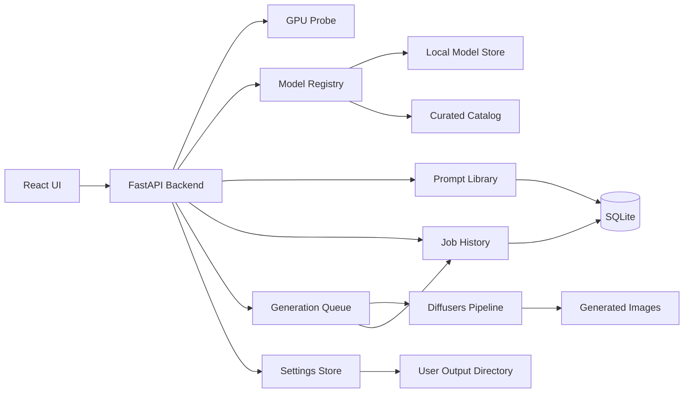
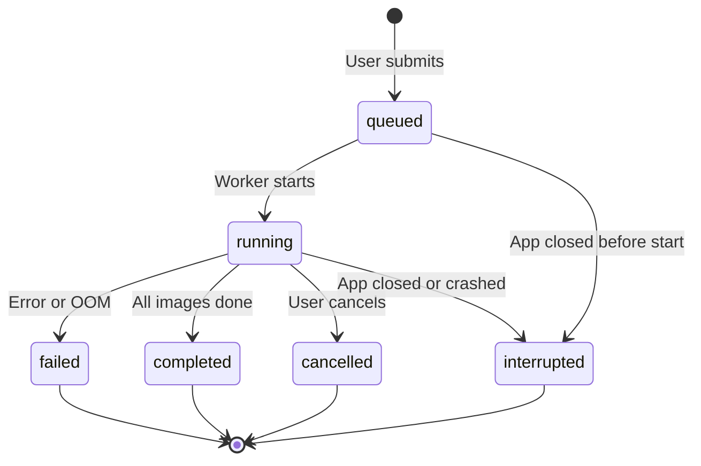

# Local Image Generator — Build Plan

> Saved for future implementation. Last updated: 2026-06-29.

## Summary

Plan a localhost image generator that detects NVIDIA GPU VRAM, filters compatible text-to-image models, lets users choose or import models, edit prompt templates, save prompts to a personal library, and generate multiple images sequentially on 8GB-class GPUs—with full job history across app restarts.

## Design Decisions

| Area | Decision |
|------|----------|
| App shell | Local web app: Python backend + browser UI at localhost |
| GPU target | NVIDIA CUDA on Windows/Linux first |
| Model management | Curated in-app catalog with downloads **and** local model import |
| Generation scope (v1) | Text-to-image only |
| Multi-image behavior | Queue sequentially with progress; safest for 8GB VRAM |
| Initial model catalog | Stable Diffusion 1.5 + selected 8GB-friendly SDXL models |
| Offline behavior | Internet only for downloading models; generation works offline afterward |
| VRAM compatibility | Show models that fit using a safe default preset; warn/limit settings that may exceed VRAM |
| Image size | Preset resolutions per model family; included in VRAM checks; no free-form custom size in v1 |
| Output directory | User-configurable image save folder; persisted locally across restarts |
| Storage | SQLite for prompt library and job history; JSON for settings and model catalog |
| Prompt workflow | Bundled editable templates **plus** user saved prompt library (search, favorites, reload) |
| Job history | All generation jobs persisted; browse, inspect, and re-run settings after restart |
| Stack | Python FastAPI backend, React UI, Hugging Face Diffusers runtime, SQLite |

## Target Product

Build a local web app with a Python FastAPI backend and React frontend. The app runs at `localhost`, uses NVIDIA CUDA first, and works offline after models are downloaded. Version 1 focuses on text-to-image generation with editable prompt templates, a saved prompt library, model selection, sequential multi-image generation for 8GB VRAM safety, and persistent job history across restarts.

## Architecture



## Project Structure

- `backend/app/main.py` — FastAPI app and route registration
- `backend/app/services/gpu.py` — detect CUDA availability, GPU name, total VRAM, free VRAM, driver/runtime info
- `backend/app/services/models.py` — curated catalog, local import scanning, VRAM compatibility filtering
- `backend/app/services/generation.py` — Diffusers pipeline loading, memory-safe generation, sequential image queue, image file writes, job persistence
- `backend/app/services/prompts.py` — bundled prompt templates and saved prompt library CRUD
- `backend/app/services/jobs.py` — job history persistence, status updates, re-run helpers
- `backend/app/services/settings.py` — load/save persistent user settings, validate output directory
- `backend/app/db/database.py` — SQLite connection, migrations, schema init
- `backend/app/db/schema.sql` — tables for saved prompts, jobs, and job images
- `backend/app/data/models.catalog.json` — curated SD 1.5 and selected SDXL model metadata
- `backend/app/data/prompt_templates.json` — bundled starter templates (read-only)
- `config/settings.json` — persisted user settings (created on first run; gitignored)
- `data/app.db` — SQLite database for prompt library and job history (gitignored)
- `frontend/src/App.tsx` — main UI shell
- `frontend/src/features/models` — model picker and compatibility messaging
- `frontend/src/features/generate` — prompt editor, settings panel, queue progress, and gallery
- `frontend/src/features/prompts` — saved prompt library browser, search, favorites
- `frontend/src/features/history` — job history list, job detail, re-run settings
- `frontend/src/features/settings` — output directory picker and persisted preferences UI

## Core Decisions

Use Hugging Face Diffusers as the first generation runtime. This keeps the app under our control, avoids depending on another web UI, and gives direct access to memory options like `torch_dtype=torch.float16`, attention slicing, model CPU offload, VAE tiling, and pipeline unloading.

Detect NVIDIA VRAM at startup using PyTorch CUDA APIs, with `nvidia-smi` as a diagnostic fallback. Store both total VRAM and current free VRAM, but filter the model list primarily by total VRAM with a conservative reserved headroom. This avoids hiding models just because another process is temporarily using the GPU, while still warning if free VRAM is currently too low.

Model compatibility should be based on model plus safe preset. Each catalog entry should include fields such as `family`, `min_vram_gb`, `recommended_vram_gb`, `default_width`, `default_height`, `default_steps`, `precision`, and `requires_license_acceptance`. Imported local models can be shown as "unknown compatibility" until the user assigns a family or the app infers metadata from the model structure.

Image size is part of the safe preset, not a separate free-form setting in v1. See [Image Size / Resolution](#image-size--resolution) below.

Generate multiple requested images sequentially through a queue. The UI can still treat this as one request, but the backend should run one image at a time, update progress after each image, clear unused CUDA memory between jobs when needed, and keep 8GB GPUs stable. Each job is written to SQLite so history survives app restarts. See [Storage & Database](#storage--database), [Saved Prompt Library](#saved-prompt-library), and [Job History](#job-history).

## Version 1 UX

The model picker shows only compatible curated models by default. A secondary "Imported / Unknown" area can show local models with clear compatibility status, but the main recommended flow should only offer models that match the detected GPU VRAM.

The prompt flow should start from bundled editable templates **or** a saved entry from the user's prompt library. A user chooses a starting point, edits the final prompt and optional negative prompt, then chooses image count, dimensions from safe presets, steps, and seed behavior. They can save the current prompt to the library at any time before generating. Generated images are saved to the user's configured output directory, recorded in job history, and shown in the in-app gallery.

The generation screen should show queue progress, per-image status, generated thumbnails (as each image completes), seed/model/settings metadata, and error messages for out-of-memory failures with a suggested lower-memory preset. Clicking a thumbnail opens a full-size preview; each image can be downloaded or opened in the file manager.

A **History** page lists past generation jobs (newest first) with status, thumbnail strip, and a **Use again** action that prefills the generate form with that job's settings.

## Image Size / Resolution

Image size is a first-class setting in v1, but only through **curated presets** tied to each model family. Users do not enter custom width/height in the first version.

### Why presets only (v1)

Resolution has a large impact on VRAM use. Presets keep compatibility predictable on 8GB GPUs and avoid users picking sizes that look valid in the UI but fail at generation time.

### Preset catalog (initial)

Each model family ships with a fixed list of allowed sizes. Each preset includes `width`, `height`, `label`, `min_vram_gb`, and `is_default`.

**Stable Diffusion 1.5**

| Preset | Size | Min VRAM | Notes |
|--------|------|----------|-------|
| Square (default) | 512 × 512 | 6 GB | Recommended baseline for 8GB cards |
| Portrait | 512 × 768 | 7 GB | Safe with fp16 and sequential generation |
| Landscape | 768 × 512 | 7 GB | Safe with fp16 and sequential generation |
| Large square | 768 × 768 | 8 GB | Allowed only when total VRAM ≥ 8 GB; show warning |

**SDXL (8GB-friendly subset)**

| Preset | Size | Min VRAM | Notes |
|--------|------|----------|-------|
| Square (default) | 1024 × 1024 | 8 GB | Requires memory optimizations (fp16, attention slicing, VAE tiling) |
| Portrait | 832 × 1216 | 8 GB | Conservative SDXL aspect ratio |
| Landscape | 1216 × 832 | 8 GB | Conservative SDXL aspect ratio |

Sizes above these are out of scope for v1. Custom width/height can be added in a later version once dynamic VRAM estimation is in place.

### How size affects compatibility

VRAM filtering uses **model + selected size preset**, not model alone.

1. On startup, detect total GPU VRAM.
2. For each model, load its allowed preset list.
3. Show the model only if at least one preset fits the detected VRAM (with reserved headroom).
4. In the generate UI, show only presets that fit for the selected model and GPU.
5. Disable presets that exceed the safe limit; show a short reason (e.g. "Requires 8 GB VRAM").
6. If the user changes model and the current preset no longer fits, auto-select the largest compatible preset for that model.

Reserved headroom: hold back ~0.5–1.0 GB from reported total VRAM before deciding what is "compatible."

### UI behavior

- Size picker appears after model selection.
- Presets are shown as labeled buttons or a dropdown (e.g. "512 × 512 — Square").
- Default selection is the model family's `is_default` preset, or the largest preset that fits on the detected GPU.
- Changing size updates a lightweight compatibility badge (Compatible / Warning / Not supported).
- Generation request payload includes `width` and `height` from the chosen preset, not user-typed values.

### OOM recovery

If generation fails with CUDA out-of-memory:

1. Release pipeline memory and clear CUDA cache.
2. Return an error that names the current size preset.
3. Suggest the **next smaller preset** for that model family, if one exists.
4. Optionally offer a one-click "Retry with smaller size" action in the UI.

Example: SDXL at 1024 × 1024 fails → suggest 832 × 1216 or switching to SD 1.5 at 512 × 512.

### Data model additions

Extend `models.catalog.json` entries with a `size_presets` array:

```json
{
  "id": "sd15-realistic-vision",
  "family": "sd15",
  "min_vram_gb": 6,
  "size_presets": [
    { "id": "512x512", "width": 512, "height": 512, "label": "Square", "min_vram_gb": 6, "is_default": true },
    { "id": "512x768", "width": 512, "height": 768, "label": "Portrait", "min_vram_gb": 7, "is_default": false }
  ]
}
```

Backend service `models.py` should expose a helper such as `get_compatible_presets(model_id, total_vram_gb)` used by both the model list and generate endpoints.

## Output Directory & Settings

Users can choose where generated images are saved. The setting is **persistent** — stored on disk and restored every time the app starts.

### Default output directory

On first run, if no setting exists, create and use a platform-specific default:

| Platform | Default path |
|----------|--------------|
| Windows | `%USERPROFILE%/OnPremImageGenerator/outputs` |
| Linux | `~/OnPremImageGenerator/outputs` |

The backend creates the default directory if it does not exist.

### User-configurable directory

In **Settings**, the user can:

1. View the current output directory path
2. Click **Browse…** to pick a different folder (native folder picker via backend API, or manual path entry as fallback)
3. Click **Save** to persist the new path
4. Click **Open folder** to reveal the directory in the system file manager

v1 uses one **global output directory** for all generations. Per-model or per-session output paths are out of scope for v1.

### Persistence

Settings are stored in a local JSON file at `config/settings.json` (relative to the app data root). This file is created on first run and should be listed in `.gitignore`.

Example:

```json
{
  "output_directory": "D:/MyImages/ai-generated",
  "last_model_id": "sd15-realistic-vision",
  "last_size_preset_id": "512x512",
  "last_steps": 25
}
```

Only `output_directory` is required for v1. Other fields are optional conveniences to restore the last-used generate form.

Persistence rules:

- Settings load on backend startup and are exposed via `GET /api/settings`
- Updates go through `PUT /api/settings` and are written to disk immediately
- If the saved path is missing on startup, attempt to recreate it; if that fails, fall back to the default directory and surface a warning in the UI
- If the saved path exists but is not writable, block generation and prompt the user to pick a new folder

### Validation

Before accepting a new output directory, the backend must verify:

- Path is absolute and normalized
- Directory exists or can be created
- The app has read/write permissions
- Path is not inside a system-protected location (basic sanity check)

Return clear errors to the UI (e.g. "Cannot write to this folder") rather than failing silently at generation time.

### File naming and layout

Each generated image is written to the configured output directory using a predictable naming scheme:

```
{output_directory}/{YYYYMMDD}/{job_id}_{index}_{seed}.png
```

Also write a sidecar metadata file alongside each image (or one JSON per job) containing prompt, negative prompt, model, size preset, steps, and seed — so outputs remain useful outside the app.

Example:

```
D:/MyImages/ai-generated/
  20260629/
    job_a1b2c3_1_4281579362.png
    job_a1b2c3_1_4281579362.json
    job_a1b2c3_2_9182736451.png
    job_a1b2c3_2_9182736451.json
```

### Gallery integration

The in-app gallery reads from job history (primary) and the output directory (fallback for orphaned files):

- Thumbnails appear in the UI as each image completes
- Each completed image is linked to its job record and file path
- Gallery entries reference the saved file path so **Open folder** and **Download** work after restart
- On app load, show recent images from job history (e.g. last 50 completed images across all jobs)
- If a file on disk is missing, show a placeholder and mark the job image record as `file_missing`

### API sketch (settings)

| Method | Endpoint | Purpose |
|--------|----------|---------|
| GET | `/api/settings` | Return current persisted settings |
| PUT | `/api/settings` | Update settings (validate output directory) |
| POST | `/api/settings/output-directory/validate` | Check a path without saving |
| POST | `/api/settings/output-directory/browse` | Optional: open native folder picker and return selected path |

### UI placement (settings)

- **Settings page** — primary place to change output directory
- **Generate page** — read-only display of current output path with a link to Settings
- Do not require users to re-select the folder each session

## Storage & Database

v1 uses a **hybrid storage** approach: simple config stays in JSON; structured, queryable data goes in SQLite.

| Data | Storage | Why |
|------|---------|-----|
| User settings (output folder, last form values) | `config/settings.json` | Small, rarely queried, easy to edit |
| Model catalog | `backend/app/data/models.catalog.json` | Shipped with app, read-only |
| Bundled prompt templates | `backend/app/data/prompt_templates.json` | Shipped with app, read-only |
| Saved prompt library | SQLite `saved_prompts` | Search, tags, favorites |
| Generation jobs & images | SQLite `jobs`, `job_images` | History, filtering, re-run |

Database file: `data/app.db` (created on first run, gitignored). Use SQLite via Python's built-in `sqlite3` or SQLAlchemy — no separate database server.

On startup:

1. Run schema migrations if needed (simple version table + incremental SQL scripts).
2. Mark any jobs still in `running` or `queued` state as `interrupted` (GPU work cannot resume mid-generation in v1).
3. Load settings from JSON and expose both stores to the API.

## Saved Prompt Library

Users can save, browse, search, and reuse their own prompts alongside the bundled starter templates.

### Two prompt sources

| Source | Origin | Editable in library |
|--------|--------|---------------------|
| Bundled templates | `prompt_templates.json` | No — copy to library to customize |
| Saved prompts | User-created, stored in SQLite | Yes |

### Saved prompt fields

| Field | Required | Notes |
|-------|----------|-------|
| `id` | auto | UUID |
| `name` | yes | Short label shown in the library list |
| `prompt` | yes | Positive prompt text |
| `negative_prompt` | no | Defaults to empty string |
| `tags` | no | Comma-separated or JSON array; used for filtering |
| `is_favorite` | no | Pin to top of list |
| `created_at` / `updated_at` | auto | Timestamps |

Optional v1 convenience fields (stored but not required to generate): `notes`, `source_template_id` if copied from a bundled template.

### UI behavior

**Prompts page** (or sidebar panel):

- List saved prompts with name, preview snippet, tags, favorite star
- Search by name or prompt text
- Filter by tag and favorites
- Actions: **Load** (prefill generate form), **Edit**, **Duplicate**, **Delete**, **Toggle favorite**

**Generate page**:

- Dropdown/tabs: **Templates** | **My prompts**
- **Save to library** button — opens a small dialog for name + tags; saves current prompt and negative prompt
- **Update library entry** — shown when the loaded prompt came from the library and was edited

### API sketch

| Method | Endpoint | Purpose |
|--------|----------|---------|
| GET | `/api/prompts/templates` | List bundled read-only templates |
| GET | `/api/prompts/saved` | List saved prompts (supports `?q=`, `?tag=`, `?favorite=true`) |
| POST | `/api/prompts/saved` | Create a saved prompt |
| GET | `/api/prompts/saved/{id}` | Get one saved prompt |
| PUT | `/api/prompts/saved/{id}` | Update a saved prompt |
| DELETE | `/api/prompts/saved/{id}` | Delete a saved prompt |

### SQLite schema (saved prompts)

```sql
CREATE TABLE saved_prompts (
  id TEXT PRIMARY KEY,
  name TEXT NOT NULL,
  prompt TEXT NOT NULL,
  negative_prompt TEXT NOT NULL DEFAULT '',
  tags TEXT NOT NULL DEFAULT '[]',
  is_favorite INTEGER NOT NULL DEFAULT 0,
  source_template_id TEXT,
  notes TEXT,
  created_at TEXT NOT NULL,
  updated_at TEXT NOT NULL
);
CREATE INDEX idx_saved_prompts_name ON saved_prompts(name);
CREATE INDEX idx_saved_prompts_favorite ON saved_prompts(is_favorite);
```

## Job History

Every generation request creates a persistent job record. History survives app restarts, crashes, and browser refreshes.

### Job lifecycle



| Status | Meaning |
|--------|---------|
| `queued` | Accepted, waiting to start |
| `running` | Generation in progress |
| `completed` | All requested images finished successfully |
| `failed` | Stopped due to error (includes OOM) |
| `cancelled` | Stopped by user |
| `interrupted` | App closed or crashed mid-job; set on next startup |

v1 does **not** resume partial GPU work after restart. Interrupted jobs remain visible in history with however many images completed before shutdown.

### Job record fields

Stored on the `jobs` table:

| Field | Notes |
|-------|-------|
| `id` | UUID, also used in output filenames |
| `status` | See lifecycle above |
| `prompt`, `negative_prompt` | Full text used for this job |
| `model_id`, `size_preset_id` | Model and resolution preset |
| `width`, `height`, `steps`, `seed`, `image_count` | Generation parameters |
| `completed_count` | How many images finished |
| `error_message` | Set when `failed` |
| `output_directory` | Snapshot of path at job creation time |
| `created_at`, `started_at`, `finished_at` | Timestamps |

Each output image gets a `job_images` row:

| Field | Notes |
|-------|-------|
| `id` | UUID |
| `job_id` | Foreign key to `jobs` |
| `index` | 1-based image index within the job |
| `seed` | Seed used for this image |
| `file_path` | Absolute path to PNG on disk |
| `status` | `completed`, `failed`, or `file_missing` |
| `created_at` | When the image was written |

Sidecar JSON files on disk remain the portable export format; SQLite is the index for fast UI queries.

### UI behavior

**History page**:

- Paginated list, newest first
- Each row: date, status badge, model name, size preset, prompt snippet, thumbnail strip of completed images
- Click a job → **Job detail** view with full prompt, all settings, all images, error message if failed
- **Use again** — prefills the generate form with this job's prompt and settings (user can edit before submitting)
- **Open output folder** — opens the job's output directory for that date
- **Delete job** — removes DB records only; optionally offer "also delete image files" as a confirm step

**Generate page** (active job):

- Show live progress against the persisted job record (not only in-memory state)
- If the user refreshes the browser mid-job, reconnect to the running job via `GET /api/jobs/{id}`

**Startup**:

- Load recent jobs into History
- Mark stale `running`/`queued` jobs as `interrupted`
- Gallery pulls recent completed images from `job_images`

### API sketch

| Method | Endpoint | Purpose |
|--------|----------|---------|
| GET | `/api/jobs` | List jobs (supports `?status=`, `?limit=`, `?offset=`) |
| GET | `/api/jobs/{id}` | Job detail with images |
| POST | `/api/jobs` | Create and enqueue a new job |
| POST | `/api/jobs/{id}/cancel` | Cancel a running or queued job |
| DELETE | `/api/jobs/{id}` | Delete job record (optional `?delete_files=true`) |
| GET | `/api/jobs/recent-images` | Recent completed images for gallery strip |

### SQLite schema (jobs)

```sql
CREATE TABLE jobs (
  id TEXT PRIMARY KEY,
  status TEXT NOT NULL,
  prompt TEXT NOT NULL,
  negative_prompt TEXT NOT NULL DEFAULT '',
  model_id TEXT NOT NULL,
  size_preset_id TEXT NOT NULL,
  width INTEGER NOT NULL,
  height INTEGER NOT NULL,
  steps INTEGER NOT NULL,
  seed INTEGER,
  image_count INTEGER NOT NULL,
  completed_count INTEGER NOT NULL DEFAULT 0,
  error_message TEXT,
  output_directory TEXT NOT NULL,
  created_at TEXT NOT NULL,
  started_at TEXT,
  finished_at TEXT
);
CREATE INDEX idx_jobs_created_at ON jobs(created_at DESC);
CREATE INDEX idx_jobs_status ON jobs(status);

CREATE TABLE job_images (
  id TEXT PRIMARY KEY,
  job_id TEXT NOT NULL REFERENCES jobs(id) ON DELETE CASCADE,
  idx INTEGER NOT NULL,
  seed INTEGER NOT NULL,
  file_path TEXT NOT NULL,
  status TEXT NOT NULL DEFAULT 'completed',
  created_at TEXT NOT NULL
);
CREATE INDEX idx_job_images_job_id ON job_images(job_id);
```

## 8GB VRAM Strategy

Prioritize SD 1.5 models as the reliable baseline. Include SDXL only with conservative defaults, such as 1024px presets where feasible and lower-memory options like attention slicing, VAE tiling, and sequential generation. Do not include very large models like FLUX in the first compatible catalog unless they are explicitly marked as unavailable for 8GB cards.

Use safeguards in generation:

- Load only the selected model pipeline, not every available model
- Use fp16 on CUDA
- Limit dimensions to curated size presets per model family (see Image Size / Resolution)
- Filter visible presets by detected VRAM before generation
- Generate images sequentially even when the user requests multiple outputs
- Unload or swap pipelines when the selected model changes
- Catch CUDA out-of-memory errors, release memory, and return actionable UI guidance

## Implementation Phases

1. Scaffold backend and frontend, add health check, GPU detection endpoint, SQLite init, and basic React shell
2. Add model catalog, size presets, and compatibility filtering based on detected VRAM
3. Add local model import scanning and metadata assignment
4. Add bundled prompt templates, saved prompt library (CRUD, search, favorites), and Settings page
5. Add Diffusers text-to-image generation for one image; save to output directory; persist job + job_images records
6. Add sequential multi-image queue, progress updates, cancellation, in-app gallery, metadata sidecars, and History page
7. Add SDXL-safe presets, out-of-memory handling, interrupted-job recovery on startup, and verification on an 8GB NVIDIA GPU

## Build Checklist

- [ ] Create the FastAPI backend, React frontend, SQLite setup, and local development scripts
- [ ] Implement CUDA GPU detection and expose VRAM/runtime information to the UI
- [ ] Build the curated model catalog, size presets, local import scanner, and VRAM compatibility filter
- [ ] Implement bundled templates, saved prompt library (CRUD, search, favorites), and generation settings UI
- [ ] Add persistent settings service, output directory picker, and validation
- [ ] Add Diffusers text-to-image generation; write PNG + sidecar metadata; persist jobs and job_images
- [ ] Add sequential multi-image queue, progress reporting, cancellation, in-app gallery, and History page with re-run
- [ ] Handle interrupted jobs on startup; verify job history and prompt library survive app restart
- [ ] Test the full flow on an 8GB NVIDIA GPU and tune safe presets

## Validation Plan

Test on an NVIDIA CUDA machine with 8GB VRAM. Verify:

- GPU detection
- Compatible model filtering (model + size preset)
- Size preset picker shows only VRAM-safe options; unsupported sizes are disabled
- OOM recovery suggests the next smaller preset
- SD 1.5 generation
- Selected SDXL generation with safe presets
- Sequential multi-image generation; thumbnails appear as each image completes
- Custom output directory can be set in Settings and persists across app restarts
- Invalid or unwritable output paths are rejected with clear UI errors
- Generated files appear on disk under the configured directory with metadata sidecars
- Gallery shows recent images from job history after restart
- Saved prompt library: create, search, favorite, load, edit, delete; survives restart
- Job history: all jobs persisted with status, settings, and image paths; survives restart
- Interrupted jobs marked correctly after app crash or close
- **Use again** from History prefills the generate form
- Prompt template editing (bundled templates + library)
- Local model import
- Offline generation after model download
- Graceful recovery from an intentional out-of-memory setting
