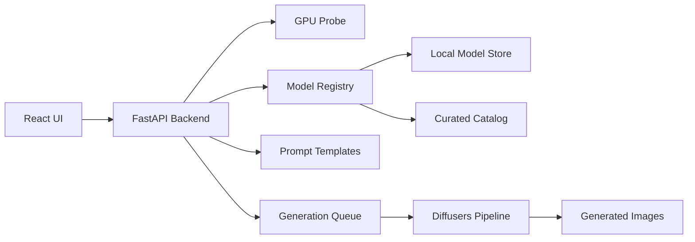

# Local Image Generator — Build Plan

> Saved for future implementation. Last updated: 2026-06-29.

## Summary

Plan a localhost image generator that detects NVIDIA GPU VRAM, filters compatible text-to-image models, lets users choose or import models, edit prompt templates, and generate multiple images sequentially on 8GB-class GPUs.

## Design Decisions

| Area | Decision |
|------|----------|
| App shell | Local web app: Python backend + browser UI at localhost |
| GPU target | NVIDIA CUDA on Windows/Linux first |
| Model management | Curated in-app catalog with downloads **and** local model import |
| Generation scope (v1) | Text-to-image only |
| Multi-image behavior | Queue sequentially with progress; safest for 8GB VRAM |
| Initial model catalog | Stable Diffusion 1.5 + selected 8GB-friendly SDXL models |
| Offline behavior | Internet only for downloading models; generation works offline afterward |
| VRAM compatibility | Show models that fit using a safe default preset; warn/limit settings that may exceed VRAM |
| Image size | Preset resolutions per model family; included in VRAM checks; no free-form custom size in v1 |
| Prompt workflow | Users pick an editable prompt template, then modify before generation |
| Stack | Python FastAPI backend, React UI, Hugging Face Diffusers runtime |

## Target Product

Build a local web app with a Python FastAPI backend and React frontend. The app runs at `localhost`, uses NVIDIA CUDA first, and works offline after models are downloaded. Version 1 focuses on text-to-image generation with editable prompt templates, model selection, and sequential multi-image generation for 8GB VRAM safety.

## Architecture



## Project Structure

- `backend/app/main.py` — FastAPI app and route registration
- `backend/app/services/gpu.py` — detect CUDA availability, GPU name, total VRAM, free VRAM, driver/runtime info
- `backend/app/services/models.py` — curated catalog, local import scanning, VRAM compatibility filtering
- `backend/app/services/generation.py` — Diffusers pipeline loading, memory-safe generation, sequential image queue
- `backend/app/services/prompts.py` — editable prompt templates and user saved prompt variants
- `backend/app/data/models.catalog.json` — curated SD 1.5 and selected SDXL model metadata
- `frontend/src/App.tsx` — main UI shell
- `frontend/src/features/models` — model picker and compatibility messaging
- `frontend/src/features/generate` — prompt editor, settings panel, queue progress, and gallery

## Core Decisions

Use Hugging Face Diffusers as the first generation runtime. This keeps the app under our control, avoids depending on another web UI, and gives direct access to memory options like `torch_dtype=torch.float16`, attention slicing, model CPU offload, VAE tiling, and pipeline unloading.

Detect NVIDIA VRAM at startup using PyTorch CUDA APIs, with `nvidia-smi` as a diagnostic fallback. Store both total VRAM and current free VRAM, but filter the model list primarily by total VRAM with a conservative reserved headroom. This avoids hiding models just because another process is temporarily using the GPU, while still warning if free VRAM is currently too low.

Model compatibility should be based on model plus safe preset. Each catalog entry should include fields such as `family`, `min_vram_gb`, `recommended_vram_gb`, `default_width`, `default_height`, `default_steps`, `precision`, and `requires_license_acceptance`. Imported local models can be shown as "unknown compatibility" until the user assigns a family or the app infers metadata from the model structure.

Image size is part of the safe preset, not a separate free-form setting in v1. See [Image Size / Resolution](#image-size--resolution) below.

Generate multiple requested images sequentially through a queue. The UI can still treat this as one request, but the backend should run one image at a time, update progress after each image, clear unused CUDA memory between jobs when needed, and keep 8GB GPUs stable.

## Version 1 UX

The model picker shows only compatible curated models by default. A secondary "Imported / Unknown" area can show local models with clear compatibility status, but the main recommended flow should only offer models that match the detected GPU VRAM.

The prompt flow should start from editable templates. A user chooses a template or style, edits the final prompt and optional negative prompt, then chooses image count, dimensions from safe presets, steps, seed behavior, and output folder/gallery behavior.

The generation screen should show queue progress, per-image status, generated thumbnails, seed/model/settings metadata, and error messages for out-of-memory failures with a suggested lower-memory preset.

## Image Size / Resolution

Image size is a first-class setting in v1, but only through **curated presets** tied to each model family. Users do not enter custom width/height in the first version.

### Why presets only (v1)

Resolution has a large impact on VRAM use. Presets keep compatibility predictable on 8GB GPUs and avoid users picking sizes that look valid in the UI but fail at generation time.

### Preset catalog (initial)

Each model family ships with a fixed list of allowed sizes. Each preset includes `width`, `height`, `label`, `min_vram_gb`, and `is_default`.

**Stable Diffusion 1.5**

| Preset | Size | Min VRAM | Notes |
|--------|------|----------|-------|
| Square (default) | 512 × 512 | 6 GB | Recommended baseline for 8GB cards |
| Portrait | 512 × 768 | 7 GB | Safe with fp16 and sequential generation |
| Landscape | 768 × 512 | 7 GB | Safe with fp16 and sequential generation |
| Large square | 768 × 768 | 8 GB | Allowed only when total VRAM ≥ 8 GB; show warning |

**SDXL (8GB-friendly subset)**

| Preset | Size | Min VRAM | Notes |
|--------|------|----------|-------|
| Square (default) | 1024 × 1024 | 8 GB | Requires memory optimizations (fp16, attention slicing, VAE tiling) |
| Portrait | 832 × 1216 | 8 GB | Conservative SDXL aspect ratio |
| Landscape | 1216 × 832 | 8 GB | Conservative SDXL aspect ratio |

Sizes above these are out of scope for v1. Custom width/height can be added in a later version once dynamic VRAM estimation is in place.

### How size affects compatibility

VRAM filtering uses **model + selected size preset**, not model alone.

1. On startup, detect total GPU VRAM.
2. For each model, load its allowed preset list.
3. Show the model only if at least one preset fits the detected VRAM (with reserved headroom).
4. In the generate UI, show only presets that fit for the selected model and GPU.
5. Disable presets that exceed the safe limit; show a short reason (e.g. "Requires 8 GB VRAM").
6. If the user changes model and the current preset no longer fits, auto-select the largest compatible preset for that model.

Reserved headroom: hold back ~0.5–1.0 GB from reported total VRAM before deciding what is "compatible."

### UI behavior

- Size picker appears after model selection.
- Presets are shown as labeled buttons or a dropdown (e.g. "512 × 512 — Square").
- Default selection is the model family's `is_default` preset, or the largest preset that fits on the detected GPU.
- Changing size updates a lightweight compatibility badge (Compatible / Warning / Not supported).
- Generation request payload includes `width` and `height` from the chosen preset, not user-typed values.

### OOM recovery

If generation fails with CUDA out-of-memory:

1. Release pipeline memory and clear CUDA cache.
2. Return an error that names the current size preset.
3. Suggest the **next smaller preset** for that model family, if one exists.
4. Optionally offer a one-click "Retry with smaller size" action in the UI.

Example: SDXL at 1024 × 1024 fails → suggest 832 × 1216 or switching to SD 1.5 at 512 × 512.

### Data model additions

Extend `models.catalog.json` entries with a `size_presets` array:

```json
{
  "id": "sd15-realistic-vision",
  "family": "sd15",
  "min_vram_gb": 6,
  "size_presets": [
    { "id": "512x512", "width": 512, "height": 512, "label": "Square", "min_vram_gb": 6, "is_default": true },
    { "id": "512x768", "width": 512, "height": 768, "label": "Portrait", "min_vram_gb": 7, "is_default": false }
  ]
}
```

Backend service `models.py` should expose a helper such as `get_compatible_presets(model_id, total_vram_gb)` used by both the model list and generate endpoints.

## 8GB VRAM Strategy

Prioritize SD 1.5 models as the reliable baseline. Include SDXL only with conservative defaults, such as 1024px presets where feasible and lower-memory options like attention slicing, VAE tiling, and sequential generation. Do not include very large models like FLUX in the first compatible catalog unless they are explicitly marked as unavailable for 8GB cards.

Use safeguards in generation:

- Load only the selected model pipeline, not every available model
- Use fp16 on CUDA
- Limit dimensions to curated size presets per model family (see Image Size / Resolution)
- Filter visible presets by detected VRAM before generation
- Generate images sequentially even when the user requests multiple outputs
- Unload or swap pipelines when the selected model changes
- Catch CUDA out-of-memory errors, release memory, and return actionable UI guidance

## Implementation Phases

1. Scaffold backend and frontend, add health check, GPU detection endpoint, and basic React shell
2. Add model catalog, size presets, and compatibility filtering based on detected VRAM
3. Add local model import scanning and metadata assignment
4. Add prompt template selection and editable final prompt UI
5. Add Diffusers text-to-image generation for one image
6. Add sequential multi-image queue, progress updates, cancellation, and gallery metadata
7. Add SDXL-safe presets, out-of-memory handling, and basic verification on an 8GB NVIDIA GPU

## Build Checklist

- [ ] Create the FastAPI backend, React frontend, and local development scripts
- [ ] Implement CUDA GPU detection and expose VRAM/runtime information to the UI
- [ ] Build the curated model catalog, size presets, local import scanner, and VRAM compatibility filter
- [ ] Implement editable prompt templates and generation settings UI
- [ ] Add Diffusers text-to-image generation with memory-safe defaults
- [ ] Add sequential multi-image queue, progress reporting, cancellation, and output gallery
- [ ] Test the full flow on an 8GB NVIDIA GPU and tune safe presets

## Validation Plan

Test on an NVIDIA CUDA machine with 8GB VRAM. Verify:

- GPU detection
- Compatible model filtering (model + size preset)
- Size preset picker shows only VRAM-safe options; unsupported sizes are disabled
- OOM recovery suggests the next smaller preset
- SD 1.5 generation
- Selected SDXL generation with safe presets
- Sequential multi-image generation
- Prompt template editing
- Local model import
- Offline generation after model download
- Graceful recovery from an intentional out-of-memory setting
